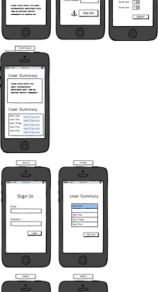
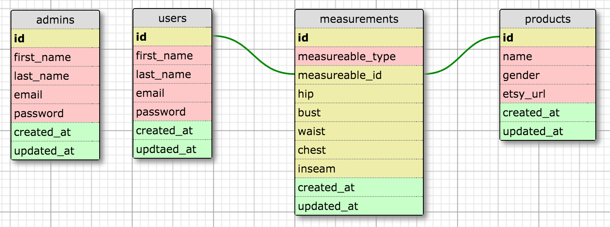

# OverAttired
OverAttired Vintage Fashion - Modern Technology for a Vintage Fit

A customer database for the Oakland vintage fashion shop, [OverAttired](https://www.etsy.com/shop/OverAttiredVintage?ref=l2-shopheader-name&show_panel=true)

inches are still inches - size has changed over time

# User Stories

**User Story 1: Loyal Customer**
* As a user I am a vintage enthusiast and I love Sam’s store
* As a user I want to go to Sam’s shop and have a staff member measure me
* As a user I want the database to save my measurements quickly
* As a user I want to get an email with a link to etsy products that match my profile
* As a user I want to receive email notifications when a new product matches my measurements

**User Story 2: Admin**
* I am Sam
* As a user I want my staff to use an iPad to record new customer profiles (measurements)
* As a user I want to update customer profiles on the fly on an iPad
* I want to visualize my customers' purchasing history in order to help guide purchasing decisions

**User Story 3: Casual Customer**
* As a user I am interested in vintage stuff but I don't dress vintage every day
* As a user I have a specific event or item I'm looking for
* As a user I will take my measurements at home and interact with a web app to build my own profile
* As a user I want the app to guide me through available styles and size recommendations
* As a user I to get an email with a link to etsy products that match my profile
* As a user I want to receive email notifications when a new product matches my measurements

# MVP Features

* responsive design - focus on mobile first
* match customers to items

# MVP WIREFRAME:

# MVP SCHEMA:

# Additional Features

* scrape Etsy to populate items in database for matching (etsy api)
* push notifications via email (mailchimp api)
* tags
* searching
* how to set up/read our code on background processes: [How-To Guide](https://medium.com/@iregina/overattired-2-setting-up-background-processes-to-automate-etsy-scraping-email-sending-48f990d86ea7)